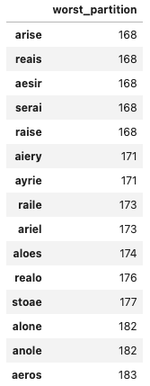
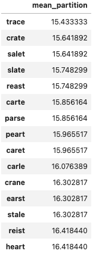

# Wordle Solver In Python

This project provides a solver for the word game Wordle. It also includes datasets, a command-line implementation of Wordle, and a Wordle solver assistant.

The solver will create a decision tree for a given starting word, which is guaranteed to solve the game in 6 guesses or fewer.
It can also generate a decision tree with 5 guesses or fewer if that option is specified.

## Decision Trees

I generated decision trees are for a few different starter words. They can be found in `out/decision_trees`.
These decision trees will solve Wordle 100% of the time using the root word in the decision tree.
Many decision trees are possible (i.e. you can use many different words to completely solve Wordle in 6 guesses or fewer).
Some of these decision trees solve every Wordle in 5 guesses or fewer rather than 6.
A partial table of the decision trees' performance can be found below:

starting word | dataset | average # of guesses to find a solution | max # of guesses to find any solution | tree size
:------------:|:-------:|:---------------------------------------:|:-------------------------------------:|:----------:
trace         | asymmetric | 3.58                                    | 5                                     | 8296
slate         | asymmetric | 3.59                                    | 5                                     | 8312
reast         | asymmetric | 3.59                                    | 5                                     | 8315
crate         | asymmetric | 3.59                                    | 5                                     | 8317
salet         | asymmetric | 3.59                                    | 5                                     | 8322
crane         | asymmetric | 3.60                                    | 5                                     | 8327
least         | asymmetric | 3.60                                    | 5                                     | 8342
train         | asymmetric | 3.60                                    | 5                                     | 8345
prate         | asymmetric | 3.61                                    | 5                                     | 8349
tares         | asymmetric | 3.62                                    | 5                                     | 8389
aesir         | asymmetric | 3.66                                    | 5                                     | 8471
serai         | asymmetric | 3.68                                    | 5                                     | 8524
-------|---------|-----|---|----
crane         | answers-only | 3.63                                    | 5                                     | 8405
crate         | answers-only | 3.62                                    | 5                                     | 8386
fresh         | answers-only | 3.78                                    | 5                                     | 8748
naval         | answers-only | 3.96                                    | 6                                     | 9177
paper         | answers-only | 3.86                                    | 5                                     | 8934
quiet         | answers-only | 3.94                                    | 6                                     | 9116
raise         | answers-only | 3.66                                    | 5                                     | 8476
slate         | answers-only | 3.63                                    | 5                                     | 8408
stout         | answers-only | 3.86                                    | 5                                     | 8927
trace         | answers-only | 3.62                                    | 5                                     | 8372

The tree size is the sum of the depths to find all answers. The lower this number, the better the tree.

These trees are **not** optimal, they're just pretty good.
It takes about 30 seconds to generate each tree for the `answers-only` dataset and about 3-5 minutes for each tree for the `asymmetric` dataset.
The `answers-only` dataset only uses words that are possible solutions (2315 possible words), whereas the `asymmetric` dataset allows guesses to be any valid 5-letter word (12,972 valid words).

Based on this table, the ideal first word to use is "trace". I know [others](https://freshman.dev/wordle/#/leaderboard) have used more compute power to find slightly more optimal words, but those solutions are not much better ("salet" with an average of 3.4212 guesses and a tree size of 7920).

## Datasets

1. [Owen Yin](https://medium.com/@owenyin/here-lies-wordle-2021-2027-full-answer-list-52017ee99e86) reverse-engineered the Wordle JavaScript app and found it contains all the solutions directly in the code.
I provide them as a machine-readable dataset in `data-raw/wordle-answers-future.txt`. There are 2315 words.

2. [Bert Fan](https://bert.org/2021/11/24/the-best-starting-word-in-wordle/) also reverse-engineered Wordle and found the complete dictionary it uses for 5-letter words (this is a combination of the `herrings` and `solutions` in his original dataset).
I provide them as a machine-readable dataset in `data-raw/wordle-words.txt`.
There are 12,972 words.

## Choosing the Next Word - Heuristic

I wanted to use all the information from my guesses when choosing the next word. I thought that even if the heuristic is a little slow, it would be helpful to choose the best word at shallower depths earlier in the search process.

I considered the best candidate word to be the word that best partitions the space of solutions.
Specifically, once we guess a word, we can potentially get 3^5 (243) possible responses from Wordle: for each letter and position, is the letter absent from the solution, present in the solution at a different position, or present at this position.
We can then use this *entire* information to partition the solution space.

For this reason, the words "slate" and "salet" are not equally good - while they may have the same letters, they give different information about the positions of those letters, and partition the space differently.

We can use 2 metrics to determine the best candidate word:

1. Best "worst" partition - the word which, in the worst case, partitions the space into the smallest number of possibilities.
2. Best "mean" partition - the word which, in the average case, partitions the space into the smallest number of possibilities.

If we want to solve the most number of problems, then we should probably use metric #1, where our optimal word is "arise", which has a worst-case partition of 168.

If we want to have the smallest expected number of guesses, then we would use metric #2, where our optimal word is "trace", which has a mean partition of 15.43.

### Partitions

Best Worst Partitions | Best Mean Partitions
:--------------------:|:---------------------:
 | 

### Using Adieu as a First Word

Don't. It has a worst partition of 284 (1.69x worse than "arise") and a mean partition of 28.94 (1.88x worse than "trace").

## Implementation

To implement the solver, I pre-computed a static matrix of possibilities that I call the **possibilities matrix**.

#### Computing the Possibilities Matrix

The possibilities matrix will be a `number_of_guess_words`x`number_of_solution_words` matrix.
The rows of the possibilities matrix are guesses (indexes into `guess_words`), the columns are answers (indexes into `answer_words`), and the element (i, j) is the response from Wordle if we were to input that guess `i` with answer `j`, encoded as an integer.
To avoid running out of memory (since we know we're computing a dense matrix with approximately 168 million elements), I made each element as small as possible - specifically an 8-bit unsigned integer.
Since there are 3^5=243 possible responses from Wordle, we can encode this response as a number between 0 and 3^5-1, which is conveniently just under 255, the maximum for the `uint8` type.
The matrix itself is implemented as a numpy matrix, which is extremely space-efficient (and allows for very fast computation) and only takes up 160MB of memory.

It took about 7 minutes to compute the possibilities matrix on my old Macbook.
While I waited, I loaded the dishwasher.
It took up 160MB on disk uncompressed, or 90MB compressed using `gzip`.
You can download it from Github LFS under `data-parsed/possibilities-table-base-3.parquet.gzip`.

As an optimization, since we know the number of solutions is smaller than the number of possible words, we can instead compute a matrix of size 12,972 x 2315 (which I call the "asymmetric" dataset). However we have to be clever here in ordering the words: we want the words to line up for all guess words that might also be solution words. This matrix takes about 2 minutes to compute and takes up only 29MB on disk and in memory (about 30 million entries). You can download it from Github LFS under `data-parsed/possibilities-table-asymmetric-base-3.parquet.gzip`.

#### Solver

The solver is a simplified recursive DFS with a branch-and-prune strategy guided by our mean partition heuristic.

Because all this is implemented in Python, we have to be extra careful about performance. We use a number of optimizations when computing our decision tree:

1. We are always maintaining the set of possible answers for every recursion call. If this ever drops to a single answer, guess that answer.

2. If we have one guess remaining and the number of possible answers is more than one, then the decision tree is not valid and we can exit early.

3. Given #2, we can do some work at one depth higher. If we have two guesses remaining and our penultimate guess partitions the space such that not all partitions are of size 1, then we can early exit.

4. We can set a maximum depth of 5, since we know that our ideal tree has depth 5.

5. If we do not find a guess word that can solve a specific guess result in a subtree, we can exit early with a negative result.

6. One further optimization which greatly speeds up our solver but leads us to pick suboptimal trees: if we find a guess that completely solves a subtree, we don't try other guesses. We therefore return the first solution. This means that the size of our generated decision tree depends on how good our heuristic is.

Wherever possible, I used numpy operations to speed up computation. When I profiled the solver, the vast majority of time was spent on heuristic computation using our matrix methods. It is possible that a worse but more efficiently-computable heuristic would work better.

#### Solver Evaluation

For each root word (first guess), it takes about 30 seconds to compute the decision tree using the "answers" dataset and matrix, and 3:30 using the "asymmetric" dataset and matrix.

## Running

Please see `RUNNING.md` for instructions on how to run.

