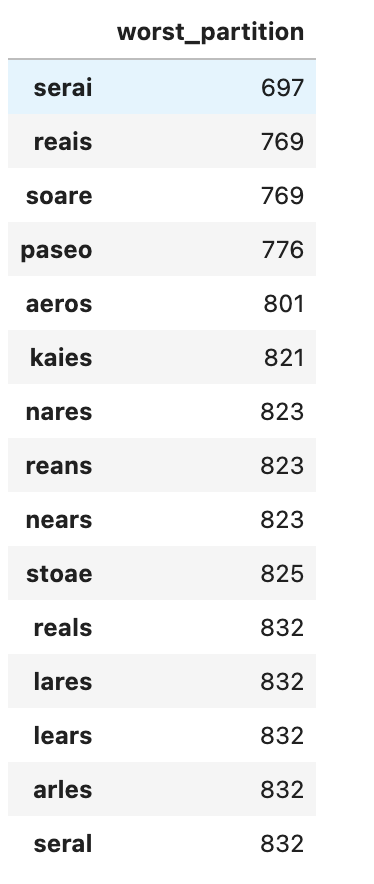
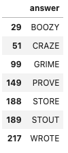
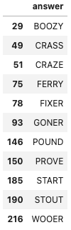
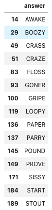
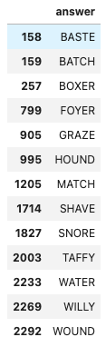

# Wordle

This project provides datasets from the word game Wordle, a command-line implementation of Wordle, and a Wordle solver assistant.
It also computes the optimal first word to use.

## Datasets

1. [Owen Yin](https://medium.com/@owenyin/here-lies-wordle-2021-2027-full-answer-list-52017ee99e86) reverse-engineered the Wordle JavaScript app and found it contains all the solutions directly in the code.
I provide them as a machine-readable dataset in `data-raw/wordle-answers-future.txt`.

2. [Bert Fan](https://bert.org/2021/11/24/the-best-starting-word-in-wordle/) also reverse-engineered Wordle and found the complete dictionary it uses for 5-letter words (this is a combination of the `herrings` and `solutions` in his original dataset).
I provide them as a machine-readable dataset in `data-raw/wordle-words.txt`.
There are 12,972 words.

## First Word Analysis

I've seen a few posts, for example by [Spencer Churchill](https://slc.is/#About) and Bert Fan, which suggest the optimal first word.
I don't think their method is quite right, so I try here to make my own contribution.

Spencer's solution doesn't use all the information in a guess - he only considers whether a word's letters are present/absent and doesn't consider the positional information. He therefore creates a static list of 3 words to try before attempting a guess.

Bert trains his solution directly on the list of solutions. I think this is a little unfair. Also Bert's metric for "best word" is "the most right spots" and has a scoring function for his best word accordingly. However this is a heuristic rather than an empirically best word.

In my analysis, I consider the optimal first word to be the word that maximizes the probability that we can guess the solution in 6 guesses or fewer.
To do this, we are looking for the word which best partitions the space of solutions.
Specifically, once we guess a word, we can potentially get 3^5 (243) possible responses from Wordle: for each letter and position, is the letter absent from the solution, present in the solution at a different position, or present at this position.
We can then use this *entire* information to partition the solution space.

For this reason, the words "arise" and "aesir" are not equally good - while they may have the same letters, they give different information about the positions of those letters, and partition the space differently.

We can use 2 metrics to determine the optimal word:

1. Best "worst" partition - the word which, in the worst case, partitions the space into the smallest number of possibilities.
2. Best "mean" partition - the word which, in the average case, partitions the space into the smallest number of possibilities.

If we want to solve the most number of problems, then we should probably use metric #1, where our optimal word is "serai", which has a worst-case partition of 697.

If we want to have the smallest expected number of guesses, then we would use metric #2, where our optimal word is "tares", which has a mean partition of 61.19.

### Partitions

Best Worst Partitions | Best Mean Partitions
:--------------------:|:---------------------:
 | 

### Using Adieu as a First Word

Don't. It has a worst partition of 1709 (2.45x worse than "serai") and a mean partition of 107.21 (1.75x worse than "tares").

## Solver

To test my approach above, I implemented a solver based on the "worst" and "mean" partition methods.
I evaluated the solver on the *known* solutions to see its hypothetical historical performance.
I tried several first words with both strategies and include some results below. More can be found in the `data-parsed/solver_eval` directory.

first word & strategy | serai (worst partition)  | tares (worst partition) | tares (mean partition) | adieu (worst partition)
:--------------------:|:-----------------------:|:-----------------------:|:-----------------------:|:-----------------------:
successful solves | 212 | 213 | 208 | 204
missed words |  |  |  | 
average # of guesses (when successful) | 4.20 | 4.25 | 4.02 | 4.26

The fact that "tares" does slightly better than "serai" under the "worst_partition" strategy can likely be explained by differences between the set of all words and the smaller set of solutions.

### Implementation

To get both the best first word and to implement the solver, I pre-computed a static nxn matrix of possibilities that I call the **possibilities matrix**.

#### Computing the Possibilities Matrix

The possibilities matrix will be a 12,972x12,972 matrix.
The rows of the possibilities matrix are guesses (indexes into `words`), the columns are answers (indexes into `words`), and the element (i, j) is the response from Wordle if we were to input that guess `i` with answer `j`, encoded as an integer.
To avoid running out of memory (since we know we're computing a dense matrix with approximately 168 million elements), I made each element as small as possible - specifically an 8-bit unsigned integer.
Since there are 3^5 possible responses from Wordle, we can encode this response as a number between 0 and 3^5-1, which is conveniently just under 255, the maximum for the `uint8` type.
The matrix itself is implemented as a numpy matrix, which is extremely space-efficient (and allows for very fast computation).

It took about 7 minutes to compute the possibilities matrix on my old Macbook.
While I waited, I loaded the dishwasher.
It took up 160MB on disk uncompressed, or 90MB compressed using `gzip`.
You can download it from Github LFS under `data-parsed/possibilities-table-base-3.parquet.gzip`.

#### Solver

The solver does the following at each step (5 times after the first guess):

1. Get the Wordle response (integer 0 - 3^5-1)

2. Based on the previous guess, use the possibilities matrix to eliminate words that are not consistent with the results.
Specifically, we drop all columns representing impossible answers.
We then drop the rows corresponding to those words as guesses.
Therefore, the matrix quickly shrinks down to 697x697 after the first guess.

3. Choose a remaining guess with the best worst partition.

4. Repeat this process until we're down to a single guess (or we're out of guesses).

On any given puzzle, the solver takes about a second to run.

#### Solver Evaluation

This took about 4 minutes to run over 219 past solutions on my laptop.
While I waited, I loaded the laundry machine.

## Running

Please see `RUNNING.md` for instructions on how to run.

## Cheating

    
SPOILERS

Because we have a complete list of all solutions into the future, we can instead find the optimal word (and strategy) to use based on this dataset.
This is definitely cheating and goes against the spirit of the game, so I put this section at the end.

The optimal first words to use are "raise" and "arise".
I computed the possibilities matrix using just the known answers, where you can find it under `data-parsed/possibilities-table-cheating-base-3.parquet.gzip` in GitHub LFS.
I then tested our "worst_partition" strategy using the first word "raises" on the entire 2315 known answers.
Our strategy was able to successfully solve 2302/2315 (99.4% success rate) with an average of 3.65 guesses per puzzle. This is just a tiny bit better than the results that [Tom Lockwood](https://lockwood.dev/wordle/python/2022/01/23/wordle-solved-average-3-64.html) was able to achieve with their solver.

The words that we missed can be found below:

The evaluation is included under `data-parsed/solver-eval/solver-eval-strat-worst_partition-future-answers-2315-raise-custom-matrix.json`

